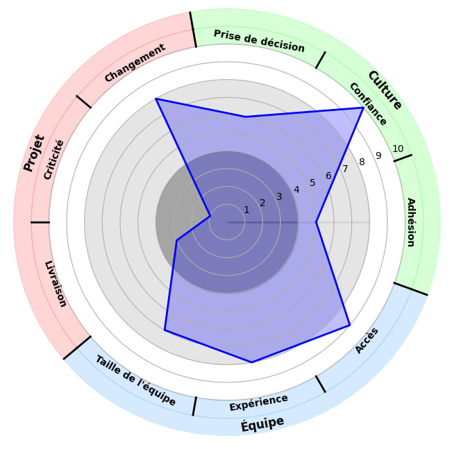

# Radar Chart Generator

This is a web application that allows users to generate a radar chart with 9 predefined criteria, divided into 3 categories. The generated chart displays a single shape connecting all the criteria, with an outer circle divided into 9 segments, each corresponding to a criterion. Each segment is labeled with the criterion's name.

## Categories and Criteria

The radar chart includes 3 main categories, each containing 3 criteria:

1. **Category 1: Culture**
   - Adhésion
   - Confiance
   - Prise de décision
2. **Category 2: Projet**
   - Changement
   - Criticité
   - Livraison
3. **Category 3: Équipe**
   - Taille de l'équipe
   - Expérience
   - Accès

## Features

- **Dynamic Radar Chart**: The application generates a radar chart that connects all the criteria into a single shape.
- **Outer Circle with Criteria Labels**: Around the radar chart, an outer circle is divided into 9 segments. Each segment corresponds to a criterion and is labeled with its name.
- **Customizable Sliders**: Users can adjust the values of the criteria using sliders (0 to 10 scale), and the chart updates dynamically to reflect these values.
  
## How It Works

1. **Input**: The user can adjust the values for each criterion using the sliders provided on the web interface.
2. **Chart Generation**: Once the form is submitted, the radar chart is generated with the selected values, and a single shape connects all the criteria.
3. **Category Labeling**: The outer circle around the radar chart is divided into 9 equal sections, each containing the name of the corresponding criterion.

## Installation

To run this application locally, follow the steps below:

1. **Clone the repository**:

   ```bash
   git clone https://github.com/your-username/radar-chart-generator.git
   ```

2. **Install dependencies**:

   ```bash
   pip install -r requirements.txt
   ```

3. **Run the application**:

   ```bash
   python app.py
   ```

4. Open your browser and navigate to `http://127.0.0.1:5000/`.

## Dependencies

The application relies on the following Python packages:

- `Flask`: A web framework used to build the interface.
- `Plotly`: Used to generate the radar chart and manage the visual layout.
- `kaleido`: A library required for saving the chart as an image.
  
Make sure that these packages are included in your `requirements.txt`:

```txt
Flask
plotly
kaleido
```

## Usage

1. **Access the web interface**: Once the app is running, open your browser and navigate to `http://127.0.0.1:5000/`.
2. **Adjust sliders**: Modify the values for each criterion using the sliders on the page.
3. **Generate the chart**: Click the "Générer le Radar Chart" button to generate the radar chart. The result will be displayed on the page, with the outer circle divided into 9 labeled segments.

## Example Output

The radar chart will display the following structure:
- **A single shape** connecting all the criteria across the 3 categories.
- **An outer ring** divided into 9 parts, with each part labeled according to the criteria (Adhésion, Confiance, Changement, etc.).



## Contributing

Feel free to contribute to this project by submitting issues or pull requests. Fork the repository and make any necessary changes. 

## License

This project is licensed under the MIT License.
